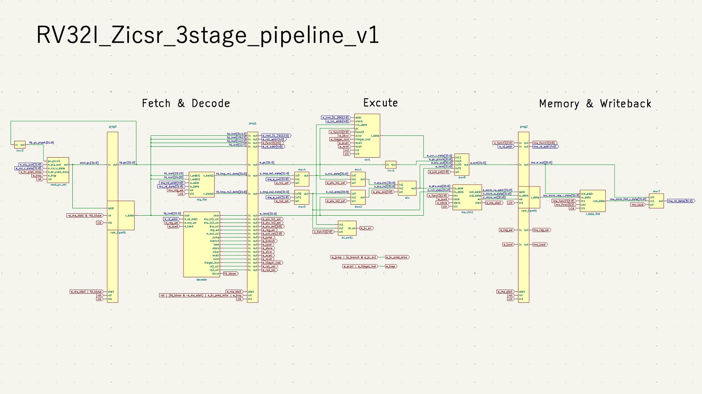
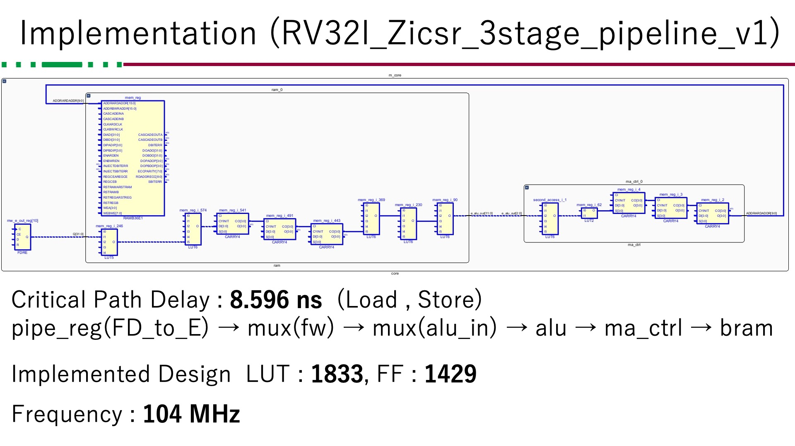
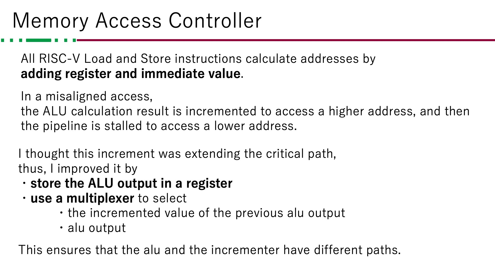
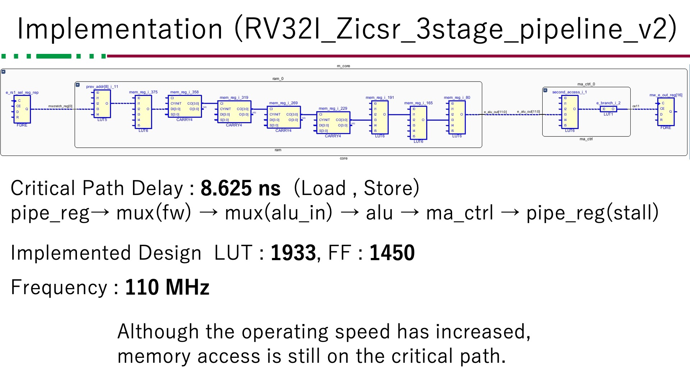
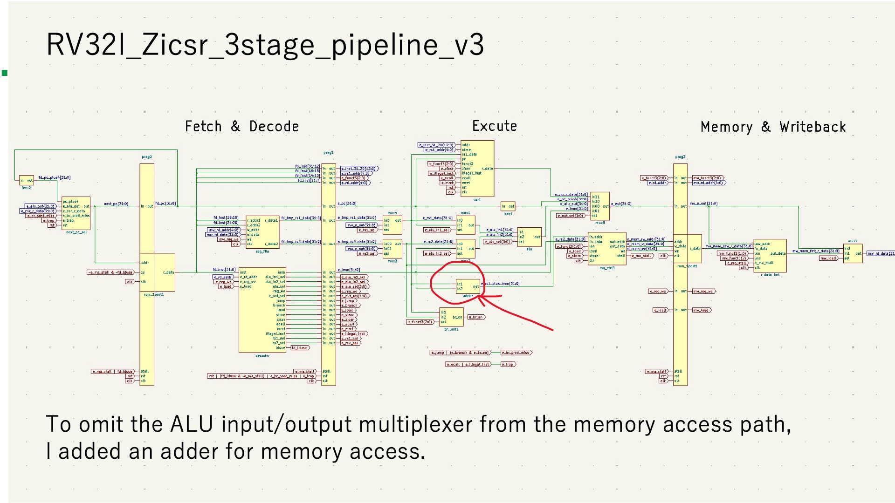
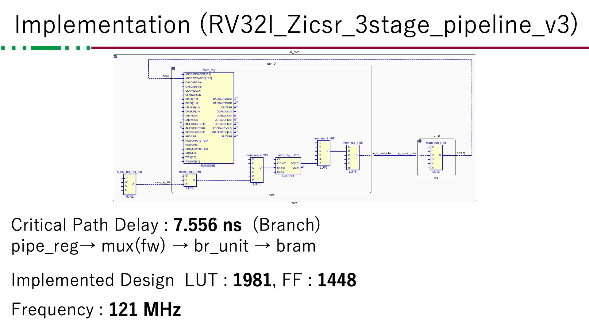
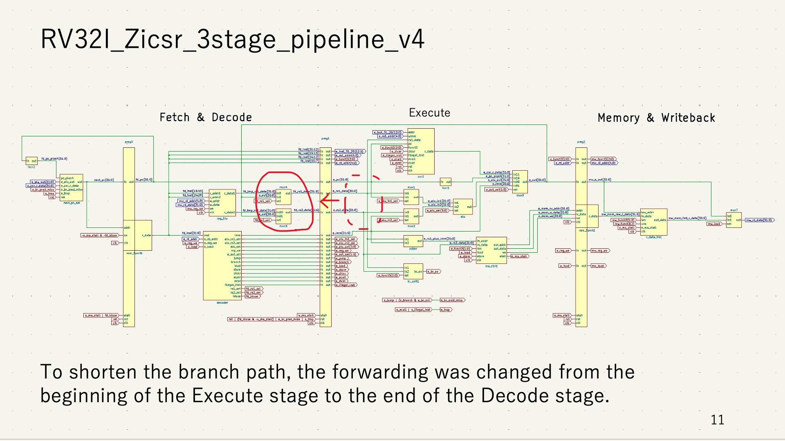
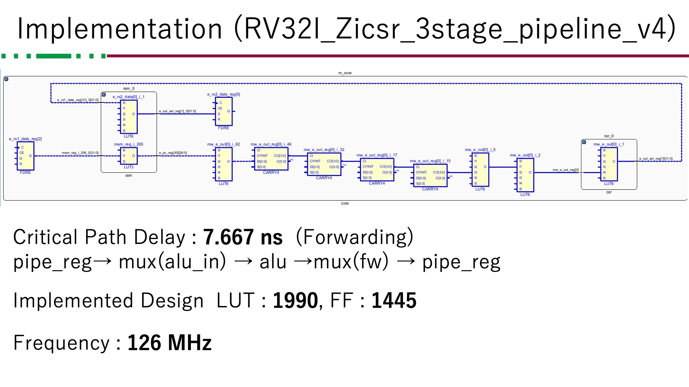

# rv32i_zicsr_3stage_pipeline
rv32i_zicsrの3ステージのパイプラインのVerilogコードです。分岐予測やキャッシュは未実装です。

Icarus Verilog を用いてシミュレーションする場合

```
iverilog define.vh core.v ram.v reg_file.v decoder.v alu.v br_unit.v ma_ctrl.v r_data_fmt.v csr.v test_all.v
```

として、macの場合は
```
./a.out
```
とすることで、全てのriscv-testsを実行します。

riscv-testsは [riscv-software-src/riscv-tests](https://github.com/riscv-software-src/riscv-tests) を用いて生成したものです。
Zybo Z7 上で動作確認をしました。

## 高速化
v1からv4にかけて周波数を向上させていきました。









