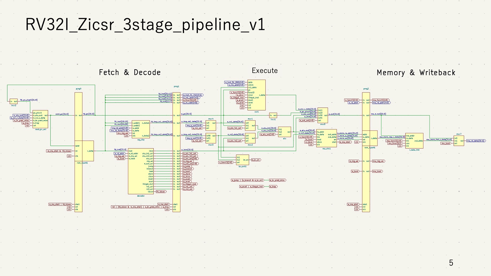
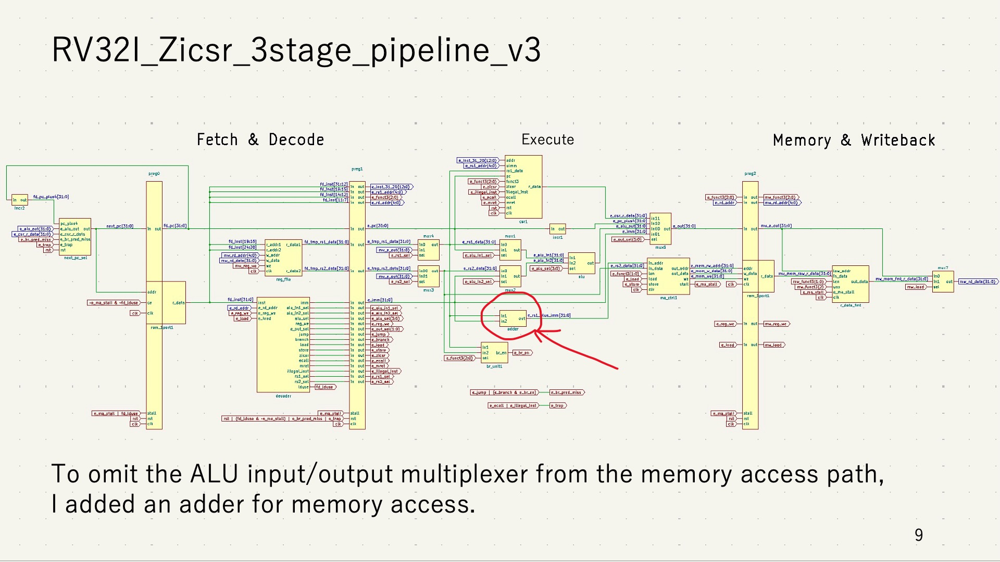

# rv32i_zicsr_3stage_pipeline
rv32i_zicsrの3ステージのパイプラインのVerilogコードです。分岐予測やキャッシュは未実装です。
riscv-testsは [riscv-software-src/riscv-tests](https://github.com/riscv-software-src/riscv-tests) を用いて生成したものです。
Zybo Z7 上で動作確認をしました。

## 高速化
v1からv4にかけて周波数を向上させていきました。

